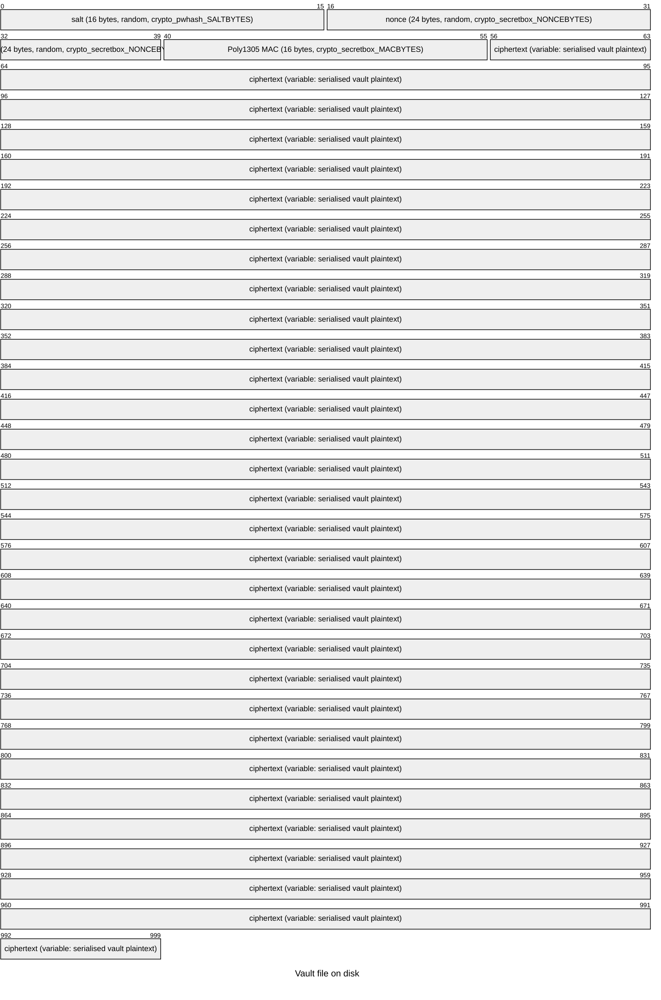

# pwman — Password Manager

[](https://github.com/arcsymer/password-manager/actions/workflows/ci.yml)


This is a learning and portfolio project. It hasn't been through a security audit, so
please don't use it for real secrets.

A command-line password manager written in C++17. It uses
[libsodium](https://libsodium.org/) for authenticated encryption (Argon2id + XSalsa20-Poly1305)
and RFC 6238 TOTP, keeps the library and CLI separate, and writes no custom crypto of its own.

---

## Problem / Solution

**Problem:** Storing credentials on disk needs both strong key derivation (to resist offline
brute-force) and authenticated encryption (to detect tampering or a wrong password without
revealing plaintext). TOTP two-factor tokens have to match the RFC 6238 standard exactly.

**Solution:**
- Argon2id (libsodium `crypto_pwhash`) derives a 256-bit key from the master password and a
  random 16-byte salt, with MODERATE memory/ops limits (~256 MiB, ~3 passes) — a deliberate
  step up from INTERACTIVE to make offline brute-force materially more expensive.
- XSalsa20-Poly1305 (`crypto_secretbox_easy`) encrypts the serialised vault with a random 24-byte
  nonce. The MAC catches any wrong-password or corruption case before any plaintext is returned.
- TOTP uses libsodium `crypto_auth_hmacsha256` to implement RFC 4226/6238 deterministically,
  checked against the official SHA-256 test vectors in Appendix B of RFC 6238.
  libsodium intentionally does not expose HMAC-SHA1, and RFC 6238 permits SHA-256 as the PRF.

---

## Security design

### Cryptographic primitives

| Layer        | Primitive                                | Library call                        |
|--------------|------------------------------------------|-------------------------------------|
| KDF          | Argon2id (MODERATE ops/mem)              | `crypto_pwhash`                     |
| Encryption   | XSalsa20-Poly1305 (authenticated)        | `crypto_secretbox_easy`             |
| TOTP MAC     | HMAC-SHA256                              | `crypto_auth_hmacsha256`            |
| CSPRNG       | OS-seeded                                | `randombytes_buf` / `randombytes_uniform` |
| Key wipe     | Compiler-resistant zero                  | `sodium_memzero`                    |

No custom cryptography: every primitive comes straight from libsodium.

### KDF parameters

| Parameter    | Value                               | Rationale                                    |
|--------------|-------------------------------------|----------------------------------------------|
| Algorithm    | Argon2id                            | Resists both GPU and side-channel attacks    |
| `opslimit`   | `crypto_pwhash_OPSLIMIT_MODERATE`   | ~3 passes; raises offline cracking cost     |
| `memlimit`   | `crypto_pwhash_MEMLIMIT_MODERATE`   | ~256 MiB memory hard                        |
| Key length   | 32 bytes (256 bits)                 | Matches XSalsa20-Poly1305 key size          |
| Salt         | 16 bytes, random per save           | Prevents precomputed (rainbow-table) attacks |

### Threat model

| Threat                                           | Mitigated? | How                                              |
|--------------------------------------------------|------------|--------------------------------------------------|
| Offline brute-force (attacker gets vault file)   | Yes        | Argon2id with ~256 MiB memory cost per guess (MODERATE) |
| Ciphertext tampering / file corruption           | Yes        | Poly1305 MAC; decryption aborts on any mismatch |
| Wrong-password oracle leaking plaintext          | Yes        | `decrypt_vault` throws before any plaintext returned |
| Nonce reuse                                      | Yes        | New random 24-byte nonce on every `save_vault`  |
| Key reuse across vaults                          | Yes        | Random salt regenerated on every `save_vault`   |
| Vault corruption on crash mid-save               | Yes        | `save_vault` writes to a temp file and `rename()`s it into place atomically; a crash leaves either the old or the fully-written new file |
| Overwriting a real vault on wrong password (`add`) | Yes      | `add` only starts a fresh vault for a missing/empty file; a wrong master password or corrupt file raises `DecryptionError`/`FormatError` instead of clobbering the existing vault |
| Memory disclosure of master password (CLI)       | Partial    | `sodium_memzero` wipes the derived key, and `secure_clear` wipes the master/export password `std::string`s on every exit path; copies made internally by libsodium are outside our control |
| In-process plaintext in memory                   | Not mitigated | Decrypted entries live in `std::vector<Entry>` on the heap; no locked/guarded allocator is used |
| Side-channel timing on MAC verification          | Yes        | libsodium's `crypto_secretbox_open_easy` uses constant-time comparison |
| Plaintext buffer lingering in memory after decrypt | Partial  | `sodium_memzero` wipes the serialised plaintext vector before it is freed; individual `Entry` strings on the heap are not locked |
| Supply-chain attack on libsodium                 | Not mitigated | Relies on the system or MSYS2 libsodium package integrity |

### What is NOT protected

- The **process address space** after decryption: plaintext passwords live in normal heap memory.
  An attacker with a process memory dump can read them.
- The **terminal**: passwords passed via `--password <pass>` are visible in `ps` output and
  shell history. Use `--password -` and pipe from a secure source to mitigate.
- **Swap / page file**: the OS may page decrypted data to disk. `mlock` / `VirtualLock` are
  not used (would require platform-specific code and elevated privileges on most systems).
- **Clipboard**: the optional `--copy` feature is not implemented. If you paste a password
  from terminal output, the clipboard is outside this tool's control.

### Why HMAC-SHA256 for TOTP (not SHA-1)

RFC 6238 §1.2 lists SHA-1, SHA-256, and SHA-512 as valid PRFs. libsodium deliberately
omits HMAC-SHA1 because SHA-1 is considered cryptographically weak in general (though it
is not broken in the HMAC context specifically). Using HMAC-SHA256 keeps libsodium as the
only dependency and avoids SHA-1 entirely. The trade-off is that codes produced here will
**not match** codes from consumer authenticator apps (Google Authenticator, Authy, etc.)
that default to HMAC-SHA1 — this is a known, intentional constraint of this portfolio project.

---

## Vault file format

### Byte layout



```
Offset 0              16             40             56
       +--------------+--------------+------+------------ ...
       | salt         | nonce        | MAC  | ciphertext
       | 16 bytes     | 24 bytes     | 16 B | len(plaintext) bytes
       +--------------+--------------+------+------------ ...
```

### Serialised plaintext format (inside the ciphertext)

```
[PWMV1\x00\x00\x00]           8 bytes magic
[entry_count]                  4 bytes little-endian uint32
For each entry:
  [0x1F] [id_decimal]          field sep + id as ASCII decimal
  [0x1F] [name]
  [0x1F] [username]
  [0x1F] [url]
  [0x1F] [password]
  [0x1F] [notes]
  [0x1F] [tag1 0x1E tag2 ...]  tags joined with Record Separator
  [0x1D]                       Group Separator = end of entry
```

Delimiter bytes (`0x1F` Unit Separator, `0x1E` Record Separator, `0x1D` Group Separator)
are ASCII control characters that never appear in normal UTF-8 user data, so no escaping
is needed.

### Encrypt / decrypt flow

```mermaid
flowchart TD
    A([Master password + Vault]) --> B[serialize Vault to plaintext bytes]
    B --> C[randombytes_buf: generate salt + nonce]
    C --> D["crypto_pwhash(Argon2id)\nkey = KDF(password, salt, 64 MiB)"]
    D --> E["crypto_secretbox_easy\nciphertext = Enc(key, nonce, plaintext)"]
    E --> F[sodium_memzero wipe key]
    F --> G([File: salt || nonce || ciphertext])

    G2([File: salt || nonce || ciphertext]) --> H[Read salt, nonce, ciphertext]
    H --> I["crypto_pwhash(Argon2id)\nkey = KDF(password, salt, 64 MiB)"]
    I --> J["crypto_secretbox_open_easy\nverify MAC + decrypt"]
    J -- MAC ok --> K[deserialize plaintext to Vault]
    J -- MAC fail --> L([throw DecryptionError])
    K --> M[sodium_memzero wipe key]
    M --> N([Vault in memory])
```

---

## Architecture

```
password-manager/
├── core/                  # pwman-core (static library)
│   ├── include/pwman/
│   │   ├── entry.hpp      # Entry struct (id, name, username, url, tags, password, notes)
│   │   ├── vault.hpp      # Vault: add/remove/find/find_by_name/search/update
│   │   ├── crypto.hpp     # serialize/deserialize + encrypt/decrypt + file I/O
│   │   │                  # + export_vault/import_vault + change_password
│   │   ├── totp.hpp       # totp() + totp_string() + base32_encode/decode
│   │   └── generator.hpp  # generate_password() + estimate_strength()
│   └── src/               # Implementations
├── cli/                   # pwman-cli (executable)
│   └── src/main.cpp       # Argument parser + command dispatch
├── tests/                 # pwman-tests (Catch2 v3, via FetchContent)
│   ├── test_totp.cpp          # RFC 6238 vectors
│   ├── test_base32.cpp        # RFC 4648 vectors
│   ├── test_crypto.cpp        # Round-trip + wrong-password + tamper
│   ├── test_vault.cpp         # add/remove/find/search
│   ├── test_vault_update.cpp  # update + find_by_name
│   ├── test_strength.cpp      # estimate_strength across all levels
│   └── test_export_import.cpp # export/import round-trip + change_password
├── IMPROVEMENT_PLAN.md    # Gap analysis and implementation plan
├── scripts/demo.sh        # Non-interactive CI demo
└── .github/workflows/ci.yml
```

**Dependencies:**
- libsodium (system, `libsodium-dev` on Ubuntu)
- Catch2 v3.5.4 (fetched by CMake FetchContent, no system install required)

---

## Build

```bash
# Ubuntu / Debian
sudo apt-get install -y libsodium-dev cmake build-essential pkg-config

cmake -B build -DCMAKE_BUILD_TYPE=Release
cmake --build build --parallel
```

### Windows (MSYS2 / MinGW-w64)

The project builds natively on Windows with the MinGW-w64 toolchain and a native
libsodium from MSYS2 (no MSVC required). From an MSYS2 MinGW64 shell:

```bash
# One-time: install toolchain + libsodium
pacman -S --noconfirm \
  mingw-w64-x86_64-gcc mingw-w64-x86_64-cmake \
  mingw-w64-x86_64-ninja mingw-w64-x86_64-pkgconf \
  mingw-w64-x86_64-libsodium

# Configure + build (Ninja generator)
cmake -B build -G Ninja -DCMAKE_BUILD_TYPE=Release
cmake --build build --parallel
# Produces build/cli/pwman-cli.exe
```

libsodium is located via pkg-config, so no manual paths are needed when building
from the MinGW64 shell. Both Linux and Windows are exercised in CI.

---

## Tests

```bash
ctest --test-dir build --output-on-failure
```

82 test cases across 11 files:

| File                         | Count | What is covered                                                               |
|------------------------------|-------|-------------------------------------------------------------------------------|
| test_totp.cpp                | 3     | RFC 6238 SHA-256 vectors (6 timesteps), default params, invalid arg throws    |
| test_base32.cpp              | 5     | RFC 4648 encode + decode vectors, case-insensitive decode, error, round-trip  |
| test_crypto.cpp              | 7     | Serialise round-trip, empty vault, minimal entry, encrypt/decrypt, wrong password, truncated input, random salt uniqueness |
| test_vault.cpp               | 13    | add (ids), find, remove, search by name/username/url/tags, case-insensitivity, empty vault, no matches |
| test_vault_update.cpp        | 8     | update (fields, id preserved, other entries unaffected, empty vault), find_by_name (match, case-insensitive, absent, exact-only) |
| test_strength.cpp            | 9     | estimate_strength across all five levels, label strings, entropy monotonicity  |
| test_export_import.cpp       | 7     | export/import round-trip, wrong export password, empty vault, random nonce, separate export password, change_password happy path, wrong old password |
| test_format_errors.cpp       | 7     | Wrong magic, truncated header, corrupt entry id → FormatError; bit-flipped ciphertext → DecryptionError; boundary size; zeroization path |
| test_totp_verify.cpp         | 9     | totp_verify: window=0 strict, window=1 accepts ±1 step, rejects ±2 steps, wrong code, near-epoch underflow safety, 6-digit/60s period |
| test_generator_ambiguous.cpp | 8     | exclude_ambiguous: full charset, length, no-digits combo, no-symbols combo, lowercase-only, digits-only, all-chars valid, default still emits ambiguous |
| test_hardening.cpp           | 4     | Atomic `save_vault`: filesystem round-trip, no leftover `.tmp` on success, atomic overwrite of an existing vault, `secure_clear` wipes/empties secret strings |

### RFC 6238 SHA-256 test vectors (Appendix B)

Key: raw bytes of ASCII `"12345678901234567890123456789012"` (32 bytes), digits=8, period=30:

| Unix time       | Expected code |
|-----------------|---------------|
| 59              | 46119246      |
| 1111111109      | 68084774      |
| 1111111111      | 67062674      |
| 1234567890      | 91819424      |
| 2000000000      | 90698825      |
| 20000000000     | 77737706      |

---

## Usage

### Vault operations

```bash
# Create vault and add entries
pwman-cli --vault my.vault --password masterpass add \
    --name "GitHub" --username "alice@example.com" \
    --url "https://github.com" --password-entry "s3cr3t" --tags "dev,work"

# List all entries (short form — password and notes omitted)
pwman-cli --vault my.vault --password masterpass list

# Get full details for a single entry (including password and notes)
pwman-cli --vault my.vault --password masterpass get 1

# Search (case-insensitive, matches name/username/url/tags)
pwman-cli --vault my.vault --password masterpass search dev

# Update specific fields of an existing entry (only supplied flags are changed)
pwman-cli --vault my.vault --password masterpass update 1 \
    --username "newalice@example.com" --tags "dev,personal"

# Remove by numeric id
pwman-cli --vault my.vault --password masterpass remove 1

# Remove by name (case-insensitive exact match)
pwman-cli --vault my.vault --password masterpass remove-by-name "GitHub"

# Change master password (re-encrypts vault)
pwman-cli --vault my.vault --password masterpass \
    change-password --new-password newsecret

# Verify master password
pwman-cli --vault my.vault --password masterpass unlock
```

### Export / import

```bash
# Export vault to a portable encrypted bundle with a separate export password
pwman-cli --vault my.vault --password masterpass \
    export --out backup.bundle --export-password backupsecret

# Import bundle into a new vault file
pwman-cli import --in backup.bundle --export-password backupsecret \
    --vault restored.vault --password newmaster
```

### Password strength

```bash
# Estimate the strength of any password string
pwman-cli strength "hunter2"
# → VERY_WEAK (20 bits)

pwman-cli strength "Tr0ub4dor&3!Xy9@ZpQ#"
# → VERY_STRONG (131 bits)
```

### TOTP

```bash
# Decode a Base32 TOTP secret and generate current code
pwman-cli totp --secret JBSWY3DPEHPK3PXP --digits 6 --period 30

# With fixed time (for testing — SHA-256 vector from RFC 6238 Appendix B)
pwman-cli totp --secret GEZDGNBVGY3TQOJQGEZDGNBVGY3TQOJQGEZDGNBVGY3TQOJQGEZDGNBVGY3TQOJQ --digits 8 --time 59
# → 46119246  (HMAC-SHA256; differs from SHA-1 authenticators by design)
```

### Password generator

```bash
pwman-cli generate --length 20
# Example output:
# Tr0ub4dor&3!Xy9@ZpQ#
# strength: VERY_STRONG (131 bits)

pwman-cli generate --length 16 --no-symbols
pwman-cli generate --length 12 --no-symbols --no-digits
# Exclude visually ambiguous characters (0, O, I, l, 1) — useful for typed passwords
pwman-cli generate --length 20 --no-ambiguous
```

---

## CI demo session

Captured verbatim from the `demo` step of a GitHub Actions run
(`scripts/demo.sh`, Ubuntu, libsodium):

```text
========================================
 pwman-cli  —  demo session
========================================

[1] Adding synthetic entries...
OK: added entry id=1
OK: added entry id=2
OK: added entry id=3

[2] Listing all entries...
3 entries:
[1] GitHub Demo  user=demouser@example.com  url=https://github.com  tags=dev,work
[2] Email Demo  user=demouser@example.com  url=https://mail.example.com  tags=personal
[3] Jira Demo  user=demouser  url=https://jira.example.com  tags=work

[3] Searching for 'demo'...
3 result(s) for "demo":
[1] GitHub Demo  user=demouser@example.com  url=https://github.com  tags=dev,work
[2] Email Demo  user=demouser@example.com  url=https://mail.example.com  tags=personal
[3] Jira Demo  user=demouser  url=https://jira.example.com  tags=work

[4] Searching for 'work'...
2 result(s) for "work":
[1] GitHub Demo  user=demouser@example.com  url=https://github.com  tags=dev,work
[3] Jira Demo  user=demouser  url=https://jira.example.com  tags=work

[5] Searching for 'nonexistent'...
0 result(s) for "nonexistent":

[6] Unlocking vault with correct password...
OK: vault unlocked, 3 entries.

[7] Attempting unlock with wrong password (expect error)...
ERROR: decryption failed: wrong password or corrupt data
Expected error: decryption failed.

[8] TOTP code at T=59 (HMAC-SHA256, deterministic 8-digit)...
32247374

[9] TOTP at T=1234567890 (HMAC-SHA256, deterministic 8-digit)...
42829826

[10] Generating a random 24-char password...
Z0i1Za.U;-h%-hVz([$ktDnW
strength: VERY_STRONG (157 bits)

[11] Generating alphanumeric-only password (no symbols)...
sKwo0LMXuxO3bJUu
strength: STRONG (95 bits)

========================================
 Demo complete.
========================================
```

---

## License

MIT
